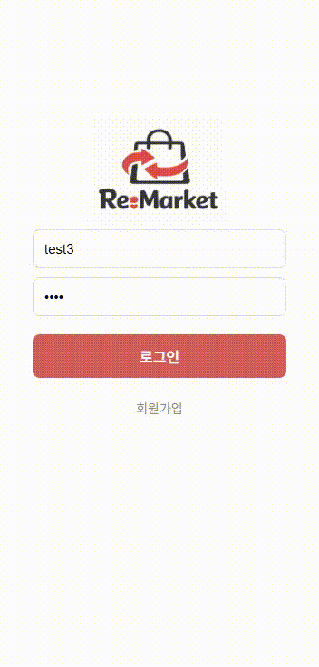
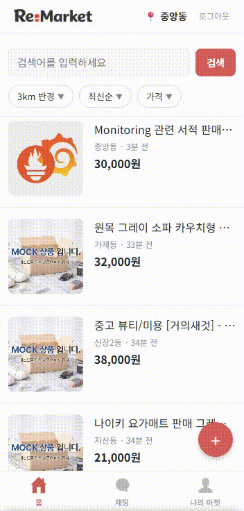
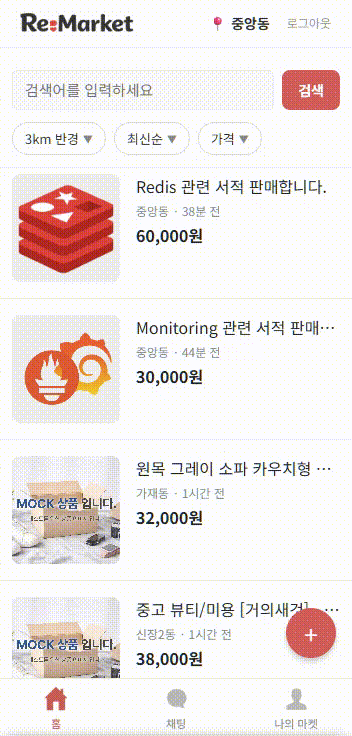
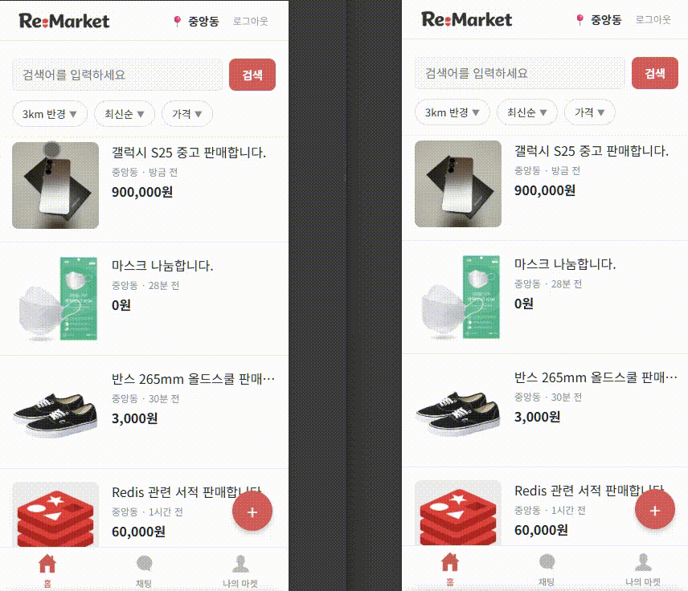
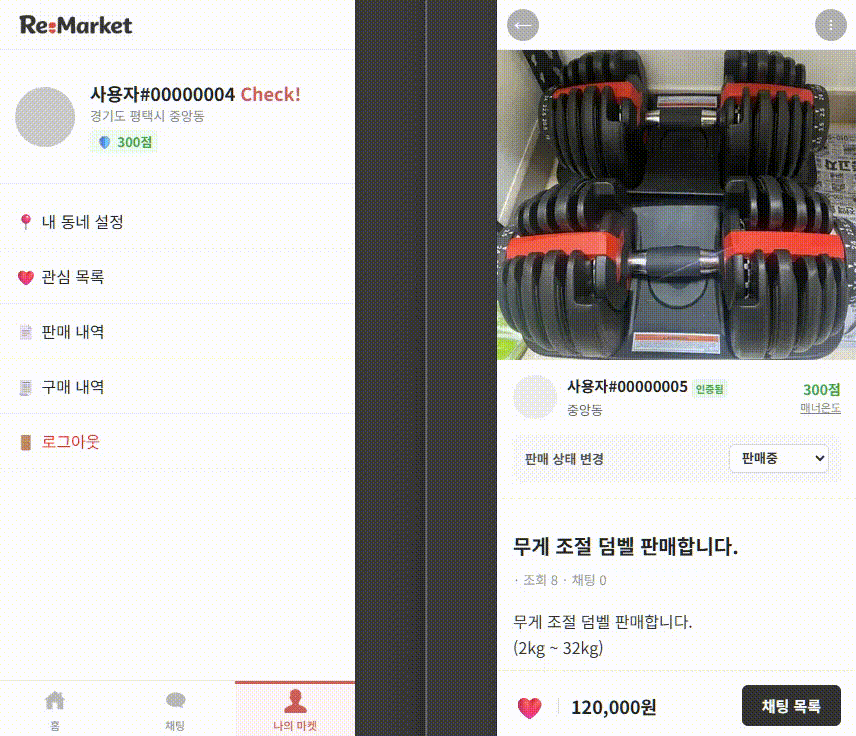
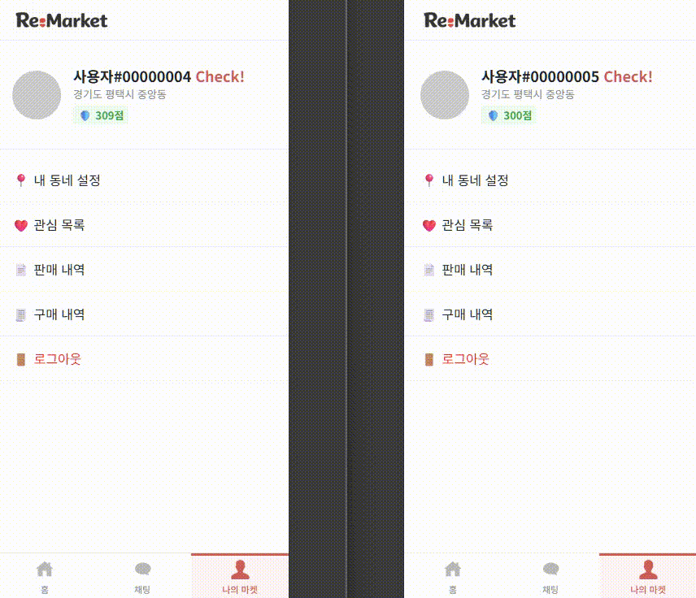

# 🛒 Re-Market (리마켓)
> **신뢰를 기술로 증명하는 하이퍼 로컬(Hyper-local) 중고 거래 플랫폼**

---
## 📋 프로젝트 개요 (Overview)

### **"우리 동네, 가장 안전한 거래의 시작"**

기존 중고 거래 플랫폼의 고질적인 문제인 **허위 매물, 사기, 신뢰도 부족**을 해결하기 위해 기획된 위치 기반 커머스 서비스입니다.

**Re-Market**은 단순한 중개를 넘어, **엄격한 위치 인증**과 데이터 기반의 **안심 지수(Safety Score)** 시스템을 도입하여 '인증된 진짜 이웃' 간의 신뢰를 기술적으로 보장합니다. 대규모 트래픽 상황에서도 안정적인 **선착순 나눔**과 **실시간 채팅**을 제공하기 위해 정교한 동시성 제어 및 캐싱 최적화 기술이 적용되었습니다.

---

## 🎯 앱 주요 기능

### 1. 위치 기반 이웃 인증 (Location Auth)
<table>
  <tr>
    <td align="center" width="50%">
       
      
내 동네 설정 (1)

    </td>
    <td align="center" width="50%">
       
      
내 동네 설정 (2)

    </td>
  </tr>
</table>

* **GPS 실시간 검증**: 사용자의 현재 좌표를 바탕으로 행정동을 인증하며, 인증된 지역 기준 반경(1.5km ~ 5km) 설정에 따른 맞춤형 매물 필터링을 제공합니다.
* **인증 기반 접근 제어**: 동네 인증이 완료되지 않은 회원은 상품 조회가 제한되며, 가입 후 최초 로그인 시 인증 페이지로 자동 리다이렉트됩니다.

### 2. 중고 거래 및 무료 나눔 (Trading & Sharing)
<table>
  <tr>
    <td align="center" width="50%">
       
      
판매

    </td>
    <td align="center" width="50%">
       
      
나눔

    </td>
  </tr>
</table>

* **재고 정합성 보장**: 인기 있는 '무료 나눔'의 경우, 분산 락과 비관적 락을 활용하여 찰나의 순간에 발생하는 중복 신청을 완벽히 차단합니다.
* **거래 상태 관리**: `판매중` -> `예약중` -> `판매완료`로 이어지는 직관적인 프로세스를 제공합니다.

### 3. 끊김 없는 실시간 채팅 (Real-time Chat)
<table>
  <tr>
    <td align="center" width="50%">
       
      
채팅

    </td>
  </tr>
</table>

* **WebSocket & STOMP**: 별도의 새로고침 없이 실시간으로 메시지를 주고받으며, 대화 중 즉시 거래 상태 변경이 가능합니다.
* **Hybrid Storage**: 채팅방 정보는 RDB(MySQL)에서 관리하고, 방대한 채팅 로그는 NoSQL(MongoDB)에 분산 저장하여 읽기/쓰기 성능을 최적화했습니다.

### 4. 데이터 기반 신뢰 평가 (Safety Score)
<table>
  <tr>
    <td align="center">
       
      
<b>판매 완료 후 신뢰도 평가 (사용자 A)</b>

    </td>
  </tr>
  <tr>
    <td align="center">
       
      
<b>판매 완료 후 신뢰도 평가 (사용자 B)</b>

    </td>
  </tr>
</table>

* **데이터 기반 신뢰도**: 거래 완료 후 매너 태그와 후기를 종합 분석하여 사용자의 온도(점수)를 갱신합니다.
* **낙관적 락(Optimistic Lock)**: 여러 사용자에게 동시에 평가를 받는 상황에서도 점수 갱신 누락이 발생하지 않도록 정합성을 유지합니다.

---

## 🛠️ 기술 스택

| Category | Technology |
| :--- | :--- |
| **Language** |  |
| **Framework** |    |
| **Database** |    |
| **Infrastructure** |   |
| **Tools & Utils** |    |
| **Monitoring** |   |

---

## 💡 핵심 비즈니스 로직 (Core Logic Deep Dive)

단순한 CRUD를 넘어, 공정하고 신뢰할 수 있는 플랫폼을 만들기 위해 설계된 상세 로직입니다.

### 1. 신뢰 지수 산정 알고리즘 (Trust Scoring Algorithm)
사용자의 안심 지수(Safety Score)는 단순한 평점 합산이 아닌, **시간 경과와 어뷰징 가능성을 고려한 4단계 복합 연산**을 통해 산출됩니다.

| 단계 | 로직 (Logic) | 설명 |
| :--- | :--- | :--- |
| **1. 기본 점수** | `Base + Tag` | 평가(만족/보통/불만족) 점수에 매너 태그 가중치를 합산합니다. |
| **2. 시간 감쇠** | `exp(-days / 90)` | **최신 거래일수록 높은 가중치**를 가집니다. (90일 기준 지수 감쇠 적용) |
| **3. 어뷰징 방지** | `Review Frequency` | 동일인과의 반복 거래 시 점수 반영률을 낮춰 **점수 조작(Boosting)을 방지**합니다. |
| **4. 신규 보호** | `New User Shield` | 거래 5회 미만 사용자는 점수 하락 폭을 완화(50%)하고 상승 폭을 제한하여 초기 이탈을 막습니다. |
| **5. 일일 제한** | `Daily Cap` | 하루 최대 상승(+25) 및 하락(-80) 폭을 제한하여 **악의적인 테러나 급격한 변동을 방어**합니다. |

### 2. 정밀 위치 인증 및 반경 계산 (Location Intelligence)
행정 구역의 모호함을 해결하고 정확한 '동네'를 정의하기 위해 외부 API와 지리수학적 공식을 결합했습니다.

* **좌표-행정동 변환**: Kakao Local API를 활용하여 위/경도 좌표를 법정동이 아닌 실생활 기준의 행정동(H-Code)으로 변환, 사용자에게 친숙한 지역 명칭을 제공합니다.
* **하버사인 공식 (Haversine Formula)**: 지구의 곡률을 고려한 구면 삼각법을 적용하여 사용자 간의 거리를 오차 범위 내에서 정밀하게 계산합니다.
  > `Level 1 (1.5km)` → `Level 2 (3.0km)` → `Level 3 (5.0km)` 단계별 이웃 범위를 동적으로 산출

---

## 🚀 기술적 도전 및 성능 최적화 (Technical Challenges)
대규모 트래픽 환경에서의 성능 병목을 해결하고 데이터 정합성을 확보하기 위해 적용한 엔지니어링 사례입니다.

### 1. 검색 및 데이터 조회 최적화
* **FullText Index**: `LIKE %keyword%` 검색의 Full Scan 문제를 해결하기 위해 **ngram 파서** 기반 역인덱스를 도입하여 검색 성능을 **55배 향상**시켰습니다.
* **N+1 문제 해결**: 1:N 관계는 `Batch Fetch`, N:1 관계는 `Fetch Join`을 적용하여 API당 쿼리 발생 횟수를 획기적으로 줄였습니다(21회 → 2회).

### 2. 동시성 제어 및 데이터 무결성
* **재고 관리 (Pessimistic Lock)**: 선착순 나눔 시 발생하는 Race Condition을 방지하기 위해 DB 레벨에서 락을 걸어 초과 당첨을 원천 차단했습니다.
* **안심 지수 (Optimistic Lock)**: 동시 평가 시 발생하는 갱신 손실을 `@Version` 기반 낙관적 락으로 해결하여 점수 데이터의 신뢰도를 유지했습니다.

### 3. Redis 기반 고가용성 캐싱
* **방파제 전략**: 메인 페이지 조회 시 **Redisson 분산 락**과 **DCL(Double-Checked Locking)**을 결합하여 캐시 만료 시 발생하는 DB 폭주(Thundering Herd)를 방어했습니다.
* **악성 요청 방어**: 존재하지 않는 ID 조회 시 `Null Object`를 캐싱하여 DB를 보호하는 **Cache Penetration 방어** 로직을 구축했습니다.

### 4. 비동기 처리를 통한 I/O 병목 해소
* **병렬 이미지 업로드**: `CompletableFuture`를 활용해 고화질 이미지 저장 작업을 병렬화하여 처리 속도를 **5배 단축**했습니다.
* **Async 서비스**: SMS 발송 등 응답 대기가 긴 외부 연동 작업을 별도 스레드 풀에서 비동기로 처리하여 사용자 경험을 개선했습니다.

---

## 📊 성능 개선 결과 요약

| 테스트 시나리오 | 적용 기술 | 개선 전 | 개선 후 | 비고 |
| :--- | :--- | :--- | :--- | :--- |
| **대규모 상품 검색** | FullText Index | 4,900ms | **88ms** | **55배 단축** |
| **메인 페이지 부하** | Redis (TTL 5s) | 341ms | **97ms** | **3.5배 향상** |
| **선착순 10명 나눔** | Pessimistic Lock | 정합성 깨짐 | **재고 0개 유지** | 초과 신청 방지 |
| **이미지 10장 저장** | CompletableFuture | 5,700ms | **1,104ms** | **5배 단축** |
| **인증 SMS 발송** | `@Async` | 3.0s | **0.01s** | 즉시 응답 |